# CmdDeck

> Your deck of ready-to-use Linux commands

A fast web app for browsing, searching, customizing and copying Linux commands for Ubuntu, Fedora and Arch. Built with React, Vite and Tailwind CSS.

[](https://cmddeck.vercel.app/)


**Try it now:** [https://cmddeck.vercel.app/](https://cmddeck.vercel.app/)

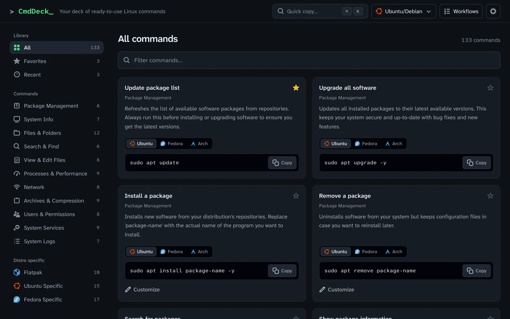

---

## Screenshots

### One command, every distro

Package commands switch between Ubuntu/Debian, Fedora/RHEL and Arch, per card or for the whole app. Distro-specific caveats appear under the command, like why Arch uses `checkupdates` instead of `pacman -Sy`.

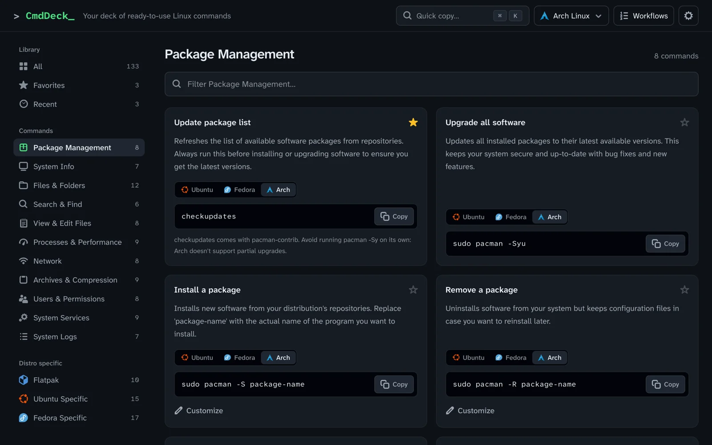

### Filter by name or by task

Search titles, descriptions, categories and every distro variant. The count shows how many of the category's commands match.

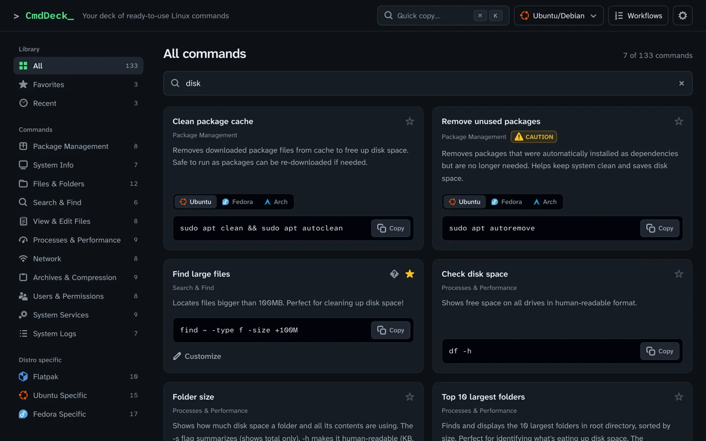

### Quick copy

Press `Ctrl+K` on Linux and Windows, `⌘K` on Mac, or `/` anywhere; type, and press Enter to copy. The shortcut shown in the app matches your system. Recent commands come first.

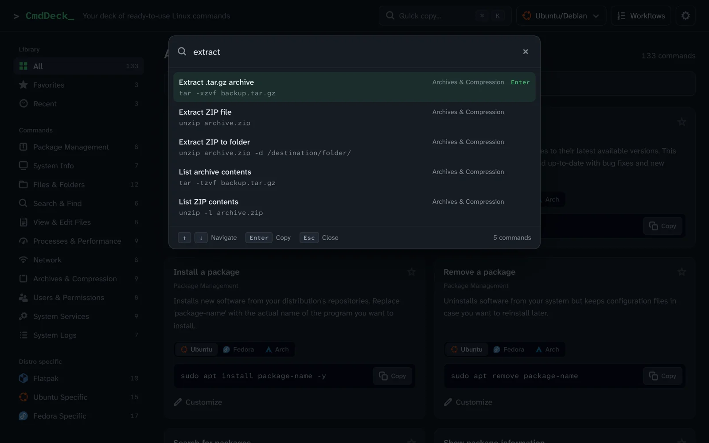

### Customize before copying

Fill in your own file names, hosts or package names. Values with spaces or special characters are shell-quoted for you.

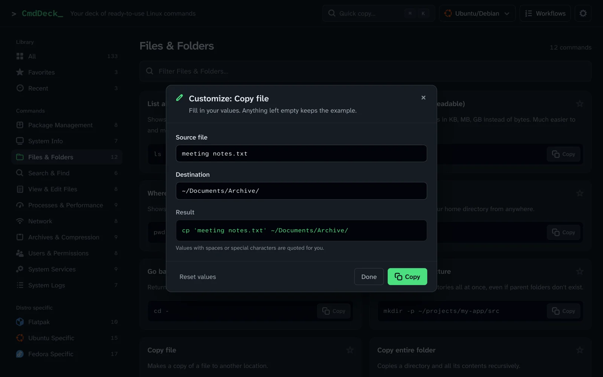

### Explain a command

Break a command down flag by flag, right inside its card.

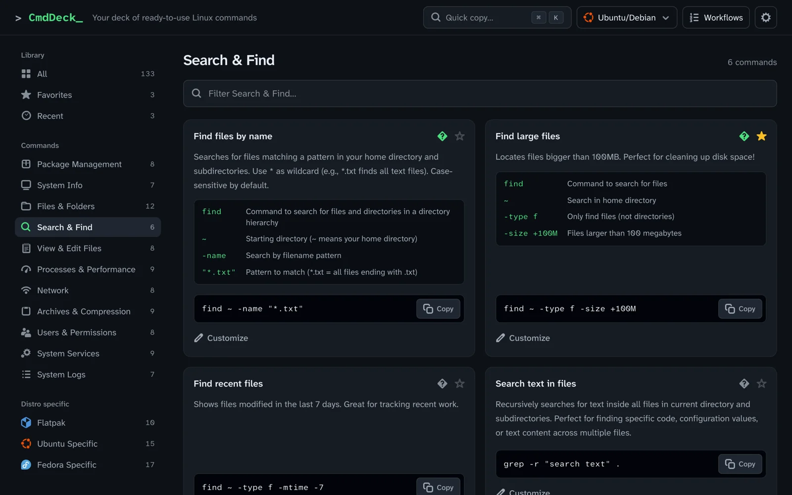

### Workflows with your own values

Step-by-step sequences for common tasks. Enter the port, PID or username once and it is filled into every step, validated and quoted. Tick steps off as you go; progress is saved in your browser.

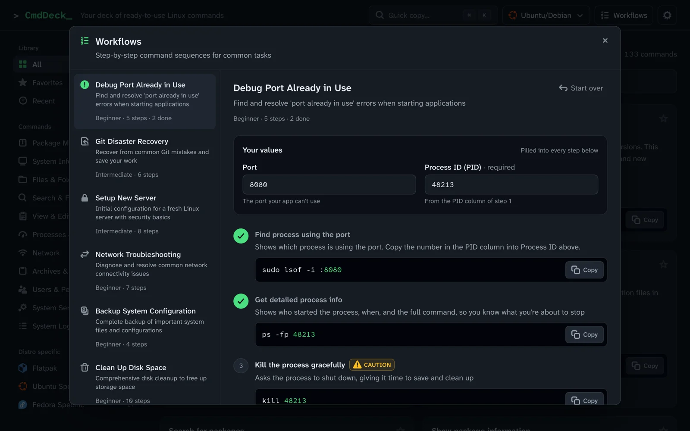

### Settings

Distribution, confirmations for dangerous commands, card density, motion, text size, data export and import, privacy, shortcuts and credits in one place.

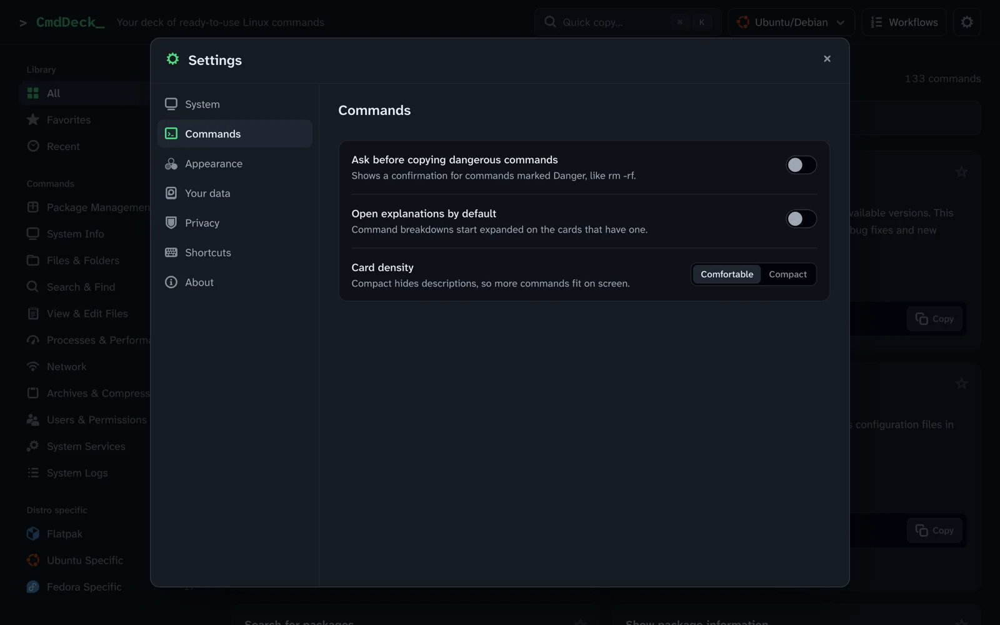

### Safety first

Risky commands carry Caution or Danger badges. Optionally, CmdDeck asks before copying anything marked Danger.

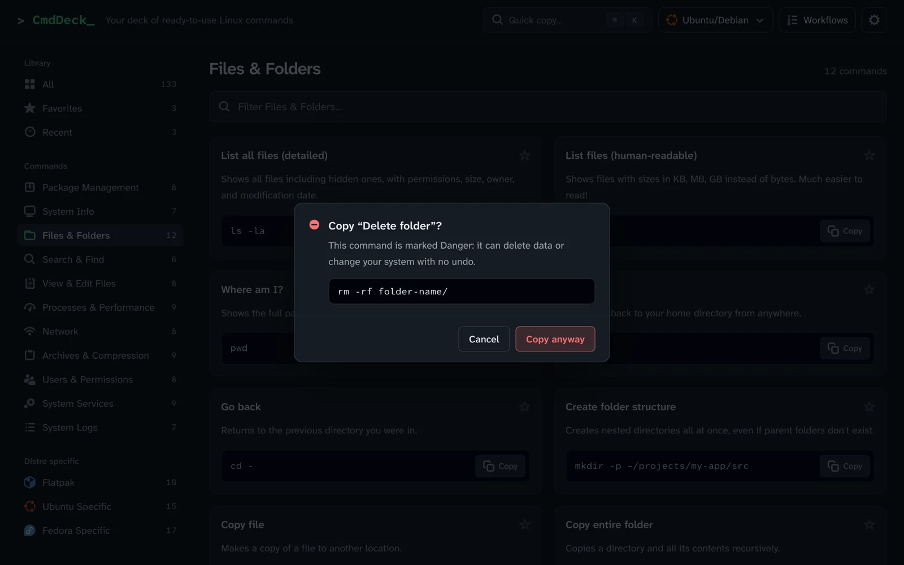

### On your phone

<p>
  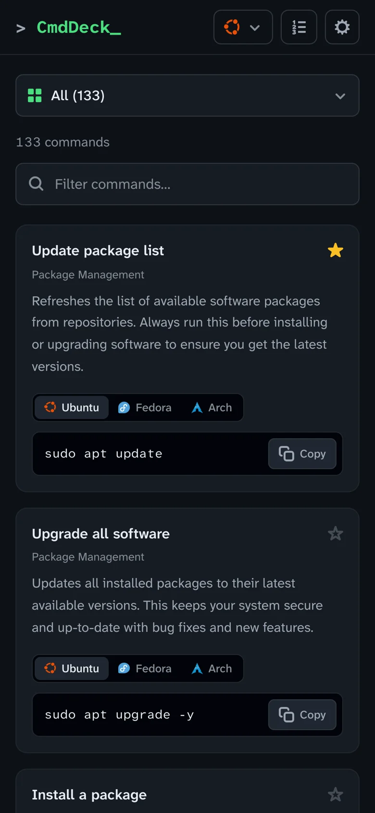
  &nbsp;
  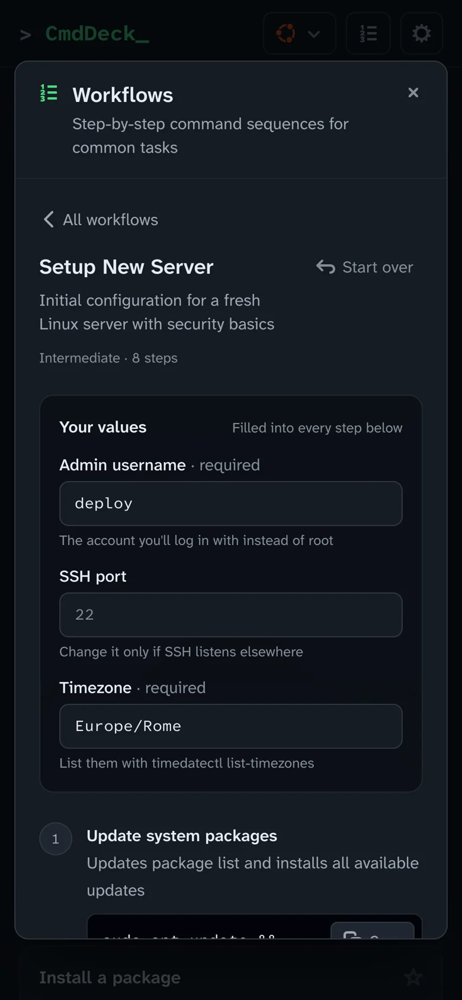
</p>

---

## Features

- **130+ commands** in 14 categories, plus Favorites and Recent
- **Multi-distro**: Ubuntu, Fedora and Arch variants with automatic detection when the browser reports it
- **Search** across titles, descriptions, categories and all distro variants; cards switch to the distro your search matches
- **Quick copy palette** with full keyboard navigation
- **Customizable commands** with automatic shell quoting
- **Explanations** for commands with many flags
- **8 workflows** with parameters, validation and a saved checklist
- **Favorites and Recent**, stored in your browser
- **Shareable URLs**: category, search and settings section live in the address bar
- **Settings** for distribution, danger confirmations, card density, motion, text size, data export/import and privacy
- **Safety badges** and an optional confirmation for dangerous commands
- **Accessible**: keyboard navigation, focus management in dialogs, WCAG AA contrast, a typeface built for legibility
- **Quiet motion** that follows your system's reduced-motion setting, or can be turned on or off
- **Privacy first**: Google Analytics loads only after you accept, and you can withdraw consent at any time in Settings
- **Pure frontend**: no backend, no account

---

## Quick Start

### Installation

```bash
git clone https://github.com/aleattino/cmddeck.git
cd cmddeck
npm install
npm run dev
```

The app opens at `http://localhost:3000`.

### Build for production

```bash
npm run build
```

The built files are in `dist/`.

---

## Command Categories

| Category | Commands | Description |
|----------|----------|-------------|
| **Package Management** | 8 | apt / dnf / pacman, switchable per distro |
| **System Info** | 7 | System information and monitoring |
| **Files & Folders** | 12 | File management and operations |
| **Search & Find** | 6 | Finding files and content |
| **View & Edit Files** | 8 | File viewing and editing |
| **Processes & Performance** | 9 | Process management and monitoring |
| **Network** | 8 | Network tools and diagnostics |
| **Archives & Compression** | 9 | Archive creation and extraction |
| **Users & Permissions** | 8 | User and permission management |
| **System Services** | 9 | Service management |
| **System Logs** | 7 | Log viewing with journald |
| **Flatpak** | 10 | Flatpak package management |
| **Ubuntu Specific** | 15 | Ubuntu/Debian commands |
| **Fedora Specific** | 17 | Fedora/RHEL commands |

Plus **Favorites** (your starred commands) and **Recent** (the last 12 you copied).

---

## Keyboard Shortcuts

| Shortcut | Action |
|----------|--------|
| `Ctrl + K` (`⌘ K` on Mac) or `/` | Open the quick-copy palette |
| `↑` `↓` | Move through results |
| `Enter` | Copy the selected command |
| `Esc` | Close dialogs and menus, or clear the filter field |
| `←` `→` | Switch distro or option in segmented controls |

---

## Tech Stack

- **[React 18](https://react.dev/)**: UI framework
- **[Vite](https://vitejs.dev/)**: build tool and dev server
- **[Tailwind CSS](https://tailwindcss.com/)**: styling
- **[Adwaita symbolic icons](https://gitlab.gnome.org/GNOME/adwaita-icon-theme)**: GNOME's own icon set (LGPL-3.0 / CC BY-SA 3.0), generated by `scripts/adwaita-icons.mjs`
- **[Atkinson Hyperlegible Next and Mono](https://www.brailleinstitute.org/freefont/)**: self-hosted via Fontsource; every character is designed to be unmistakable (`l`/`1`/`I`, `O`/`0`)
- **[PostCSS](https://postcss.org/)**: CSS processing

---

## Deployment

### Vercel

```bash
npm install -g vercel
vercel
```

### Netlify

1. Build with `npm run build`
2. Deploy the `dist/` folder, or connect the Git repository for automatic deploys

### GitHub Pages

```bash
npm run build
# Configure GitHub Pages to serve the dist/ folder
```

---

## Project Structure

```
cmddeck/
├── branding/            # Source SVGs for favicon, app icons and social image
├── docs/screenshots/    # Screenshots used in this README
├── public/              # Static assets (logos, favicon, icons, manifest)
├── scripts/             # Icon generator
├── src/
│   ├── components/      # Cards, dialogs, palette, navigation, settings, legal pages
│   ├── data/
│   │   ├── snippets.js  # All command data
│   │   ├── workflows.js # Workflows and their parameters
│   │   └── index.js     # Ids, categories, legacy-storage migration
│   ├── hooks/           # Small React hooks
│   ├── icons/           # Generated Adwaita icon data and its license
│   ├── lib/             # Search, clipboard, shell quoting, OS detection, motion, analytics consent
│   ├── App.jsx          # App shell and state
│   ├── index.css        # Global styles
│   └── main.jsx         # App entry point
├── index.html           # HTML template
├── package.json         # Dependencies
├── tailwind.config.js   # Tailwind configuration and color tokens
├── postcss.config.js    # PostCSS configuration
└── vite.config.js       # Vite configuration
```

---

## Contributing

Want to add more commands or workflows? Contributions are welcome.

1. Fork the repository
2. Create a feature branch (`git checkout -b feature/new-commands`)
3. Add your commands to `src/data/snippets.js` or `src/data/workflows.js`
4. Commit your changes (`git commit -am 'Add new commands'`)
5. Push to the branch (`git push origin feature/new-commands`)
6. Open a Pull Request

### Adding New Commands

Edit `src/data/snippets.js`:

```javascript
export const snippetsData = {
  "Your Category": [
    {
      title: "Command Title",          // unique within the category
      command: "your-command --flags",
      description: "Clear explanation of what this command does",
      dangerLevel: "caution",           // optional: "caution" | "danger"
      // Optional: let people fill in their own values
      interactive: true,
      inputs: [{ label: "File", placeholder: "file.txt", param: "file" }],
      commandTemplate: (params) => `your-command ${params.file || 'file.txt'}`
    }
  ]
};
```

Each command's id is derived from its category and title, and favorites and recents are stored by id: renaming a title resets them for that command. Values typed in the Customize dialog are shell-quoted before they reach `commandTemplate`, so don't wrap `${params.x}` in quotes yourself (add `raw: true` to an input that should stay unquoted, like a whole command).

### Adding Workflows

Edit `src/data/workflows.js`:

```javascript
{
  id: "unique-id",
  title: "Workflow Title",
  description: "What this workflow accomplishes",
  difficulty: "beginner", // or "intermediate", "advanced"
  icon: "Save", // one of: Activity, AlertCircle, Archive, Container, Globe, Lock, Save, Trash2
  // Optional: values typed once and filled into every {{key}} below
  params: [
    { key: "port", label: "Port", default: "3000", numeric: true, pattern: /^\d{1,5}$/, invalid: "Use a port number", hint: "Shown under the field" },
    { key: "pid", label: "Process ID", example: "12345" } // no default = required
  ],
  steps: [
    {
      title: "Step 1",
      description: "What this step does",
      command: "sudo lsof -i :{{port}}",
      dangerLevel: "caution" // optional
    }
  ]
}
```

Values are shell-quoted when they're filled in, so write `{{key}}` without quotes around it.

---

## Bug Reports and Feature Requests

Found a bug or have an idea? Open an issue on GitHub.

---

## License

MIT License. See [LICENSE](LICENSE) for details.

Copyright (c) 2025 Alessandro Attino

---

## Acknowledgments

- Command reference from Ubuntu, Fedora, Arch and Linux community documentation
- Icons: Adwaita symbolic icons by the [GNOME Project](https://www.gnome.org), LGPL-3.0 or CC BY-SA 3.0 US (see `src/icons/LICENSE.md`)
- Typeface: Atkinson Hyperlegible by the Braille Institute
- Ubuntu, Fedora, Arch Linux and Flatpak logos are property of their respective owners

---

Made by Alessandro Attino
